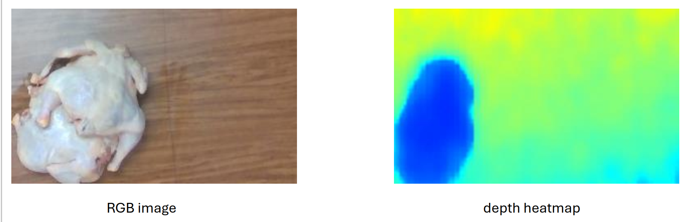
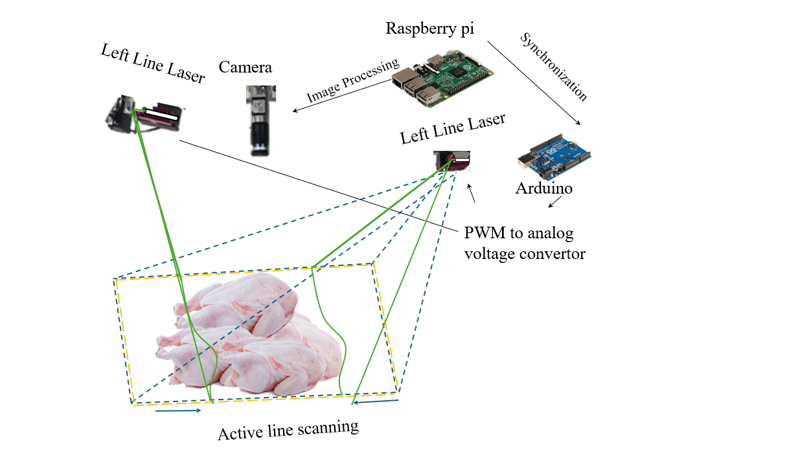
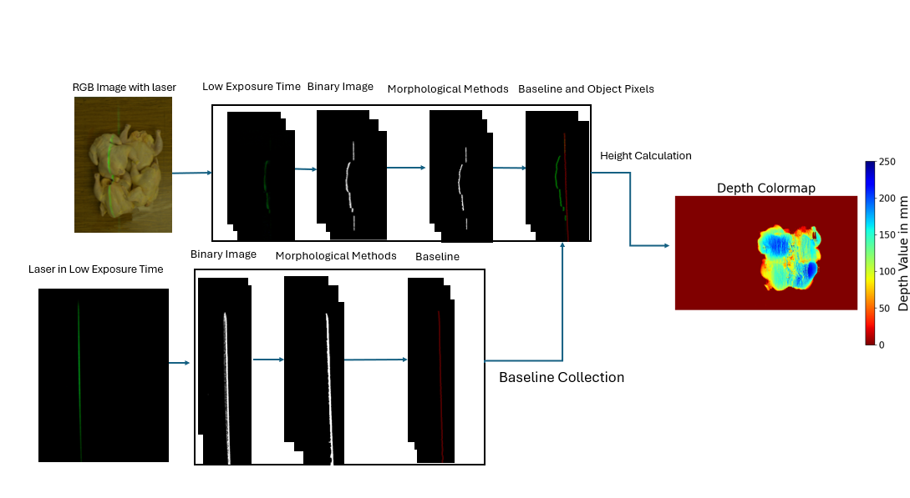

# Active-Dual-Line-Laser-Scanning-System
This repository is  my master’s research at the University of Arkansas, focusing on developing a low-cost, Arduino-based active sensing system for 3D vision applications in robotics.

The first component focuses on accurate depth estimation of chickens. While Intel RealSense cameras provide accessible depth data, their accuracy significantly degrades in challenging scenarios—particularly when chickens are piled together. This results in poor boundary definition and unreliable depth measurements, as illustrated in the provided image. To overcome these limitations, our system integrates a dual-line laser approach for enhanced precision in dense, occluded environments.

The primary goal is to control a line laser using a servo-actuated mirror, enabling dynamic projection of the laser across a scene. By observing the displacement of the laser line relative to a calibrated baseline, the system can infer depth information — a key step in reconstructing 3D geometry of objects.
Key Concepts:
The mirror angle is controlled via PWM signals from an Arduino, which determines the laser projection angle.

The baseline laser position is mapped based on known mirror angles.

When an object is introduced into the field, the laser line shifts from its baseline.

This shift is used to compute depth, enabling 3D surface profiling.

The given Diagram provides the hardware system setup

The given diagram demonstrated the image processing method that used to extract the object pixels and baseline to estimate the depth

The second component focuses on training instance segmentation models using both RGB and RGB-D data. In our publication, we evaluated SAM, YOLOv8, and Mask R-CNN across various backbones on our custom poultry dataset. While comprehensive results are detailed in the paper, this repository highlights the best-performing configuration—Mask R-CNN trained on RGB-D data—which demonstrated the most accurate segmentation performance.

